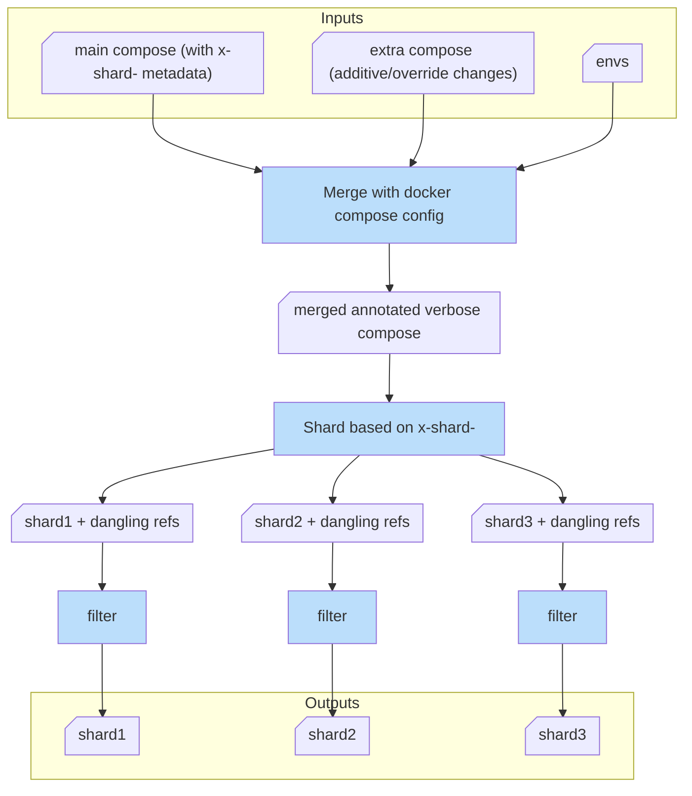

# Docker Compose Converter

We had a situation, where we had to deploy into an environment, where the different
network zones were highly separated from each other with strict firewall rules.
The firewall rules also forbade to use software defined networks, like with Docker
Swarm. Still, I didn't want to give up the convenience, that every developer can
simply spin up the whole project with a simple `docker compose up` command.

So is `compose-sharder` born. With some advanced docker compose features and this little script, one can sustainably have a single source of truth in one compose file, and programatically
split it up into multiple *valid* compose files.

Remark: As this grew out of a specific use case, it is not a fully generic solution,
but could be helpful for others in similar situations.
Notably the targeted three shards are `proxy/orange`, `app/yellow`, and `db/green`,
which is arguably quite a common setup in data centers, but not the only one.

## Overview

1. **Compose extension**: The main compose file is marked up with a [custom extension](https://docs.docker.com/reference/compose-file/extension/), `x-shard` to denote *which service is to be put into which shard*. (If a service is not marked, it won't be included in any shard.)

2. **Fragments**: With [fragments](https://docs.docker.com/reference/compose-file/fragments/),
the zone-specific metadata is grouped, so it *doesn’t need to be repeated* for each service again and again.

3. **Merging**: With the help of [merging](https://docs.docker.com/reference/compose-file/merge/),
*additive information is defined outside of the main compose*. This can be site/customer specific. Think about exporting ports, which is not needed if we have the software-defined networks.

4. **Sharding**: The python script, then parses the main compose file and splits it into the target shards. But it also removes "dangling" references, like `depends_on`, `networks`, and `volumes`, which are not needed in the shards, and would result in an invalid compose file.
(The script also removes the `x-shard` extension from the shards.)

5. **Verification**: The script can also verify the shards, by running `docker compose config` on them. This is optional, but recommended.

Remarks:
- The shards are dumped in the same verbose format that `docker compose config` emits.
- The shards have a deterministic ordering due to `PyYAML`, which makes it easier to version control them.

# Compose-Sharder Flow



## Requirements

- `docker compose` is required for merging and verification.
- [PyYAML](https://pypi.org/project/PyYAML/) for YAML file manipulation.
- *OPTIONAL* `uv` is preferred for running the script, but you can provide PyYAML
  in whatever way you like.

## Usage

Run the script using:
```bash
uv run compose-sharder.py -i compose.yaml -e envs/config.env --no-verify
```

If you don't have `uv` installed, you can e.g. use a virtual environment:
```bash
python -m venv venv
. venv/bin/activate
python -m pip install PyYAML
python compose-sharder.py -i compose.yaml -e envs/config.env --no-verify

## Example

The `example.sh` and the `example/` directory show the basic usage.
Note, the compose has just placeholder services, illustrating the concept.
There is no sense to try `docker compose up` on it.
